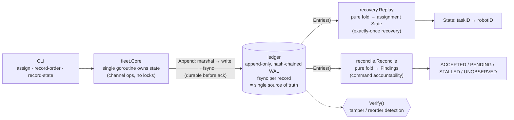

# fleet-master-controller

**An audit & deterministic replay layer for robot fleets** (VDA5050) — built to
demonstrate that distributed-systems reliability is *domain-independent*: the
same guarantees that keep money consistent in financial settlement, applied to
coordinating many robots.

> Thesis: keeping *N* independent agents consistent under partial failure is the
> same problem whether the agents move money or move pallets. This repo is the proof.

## Reliability properties

| Property | Status | Package |
|----------|--------|---------|
| **Tamper-evident audit ledger** — any edit/deletion/reorder of history is detected (hash-chained, append-only); doubles as the durable WAL | ✅ done | `internal/ledger` |
| **Exactly-once crash recovery** — a fresh process rebuilds exact pre-crash state by replaying the WAL (deterministic, idempotent fold) | ✅ done (slice) | `internal/recovery` |
| **Command-acceptance accountability** — prove, purely from the ledger, whether every issued VDA5050 order was accepted by its robot: `ACCEPTED / PENDING / STALLED / UNOBSERVED` | ✅ done | `internal/reconcile` |
| **Collision-free concurrent task allocation** — no task assigned twice under contended concurrent claims; all state owned by a single goroutine, ownership enforced by the compiler | ✅ done | `internal/fleet` |
| Graceful dropout reassignment — a robot dropping out → its tasks reclaimed exactly once | ✗ next | `internal/reassign` |

The audit ledger is the spine: crash recovery replays it, and the reconciliation
layer reads it to make command acceptance provable after the fact — the fleet
analogue of financial settlement reconciliation (sent instruction vs confirmation).

## Architecture

One durable, ordered, tamper-evident truth; one writer; two pure-fold readers.



## Layout

```
cmd/controller/      CLI: assign / recover / verify / record-order / record-state / reconcile
internal/ledger/     hash-chained append-only audit log = durable WAL   [done]
internal/recovery/   deterministic replay (fold) of the ledger          [done]
internal/fleet/      single-goroutine Core: owns state, channel ops      [done]
internal/reconcile/  command-state reconciliation (accountability)       [done]
internal/event/      shared event vocabulary
internal/vda5050/    VDA5050 v2.x message types + MQTT topic helpers      [types only]
internal/reassign/   dropout reassignment                                [interface]
docs/design.md       reliability properties, crash semantics, roadmap
```

## Run

```bash
go test -race ./...

# crash recovery: assign in one process, recover in another
go run ./cmd/controller assign  /tmp/fleet.wal agv-01 pick-A pick-B
go run ./cmd/controller recover /tmp/fleet.wal
go run ./cmd/controller verify  /tmp/fleet.wal

# accountability: issue an order update the robot lags on -> STALLED
go run ./cmd/controller record-order /tmp/fleet.wal agv-01 ORD-1 2
go run ./cmd/controller record-state /tmp/fleet.wal agv-01 ORD-1 1 false
go run ./cmd/controller reconcile    /tmp/fleet.wal      # exits nonzero on STALLED/UNOBSERVED
```

## Standard

[VDA5050](https://github.com/VDA5050/VDA5050) — the interface between fleet
controllers and AGVs/AMRs (MQTT + JSON). This repo targets **v2.x** (the widely
deployed line; v3.0.0 shipped 2026-03). `(orderId, orderUpdateId)` is the
protocol's idempotency key — the direct analogue of a payment idempotency key:
an identical re-issue is a no-op, while the same `orderUpdateId` with *different
content* is the spec's `SAME_ORDER_UPDATE_ID` WARNING. (The reconciler's
`STALLED`/`UNOBSERVED` are a separate, honest "unconfirmed" signal — not that
condition.)

## Status

Audit ledger, exactly-once recovery (slice), command-acceptance accountability,
and collision-free allocation under contended load are done and `-race`-clean.
Dropout reassignment (P4: lease + fencing) is next, snapshot/compaction after;
MQTT ingestion to feed real VDA5050 traffic after that. See
[`docs/design.md`](docs/design.md). Phase A career-pivot evidence toward
autonomous-fleet orchestration.
