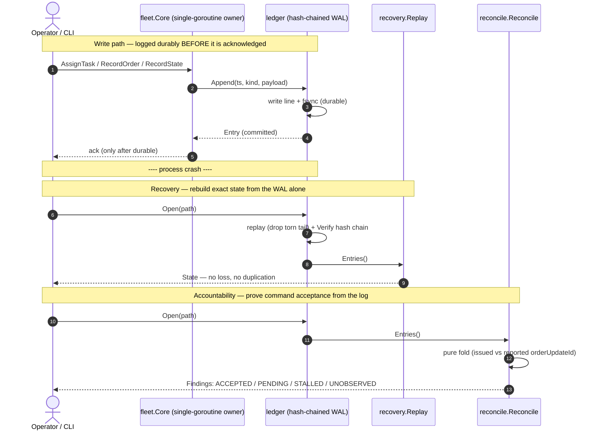

# Design notes — fleet-master-controller

## Why this exists

Career-pivot evidence (Phase A): the single biggest gap is a *fleet controller
deliverable*. This project closes it by proving four reliability properties that
transfer directly from financial settlement systems to robot-fleet
orchestration. Built in Go to read like the control-plane world it targets
(single-owner goroutine + channels, WAL, reconcile loop).

## Core invariant

> Each task is assigned **exactly once** at any moment, the assignment history
> is **tamper-evident**, and the system **recovers without loss or duplication**
> across both process crashes (②) and robot dropouts (④).

Demo ① (concurrency control) and ② (exactly-once recovery) are the same two
guarantees as fintech exactly-once processing, re-expressed for tasks. Demo ③
(hash-chained ledger) is the auditable record that makes both provable after the
fact. Demo ④ is the fleet-specific failure mode (Kubernetes-style reconcile).

## Core flows

Durable write → crash → recovery, and accountability — all over the one WAL:

The `.mmd` sources are in `docs/` (`architecture.mmd`, `Sequence.mmd`).

## 0-stage vertical slice — DONE (2026-06-08)

Robot + task + durable WAL + crash recovery, one full pass, hardened after an
adversarial review. What it proves today:

- **P3** hash-chained append-only ledger; interior tamper/reorder detected by `Verify`.
- **P2** exactly-once recovery: a fresh process rebuilds the exact assignment set from the WAL.
- **P1 seed** single goroutine owns the assignment map; 32-racer contended task → exactly one winner (`-race` clean). Since deepened to full P1 — see below.
- Collision-free assignment; `ErrAlreadyAssigned` / `ErrClosed` sentinels.

### Crash semantics (implemented — the subtle part)

- **Torn trailing record** (mid-write power loss): the canonical crash shape.
  Replay drops the unterminated tail and truncates the file to the last complete
  record; every prior fsync'd (acknowledged) record still recovers. A torn tail
  must never brick recovery.
- **Interior corruption** (a complete record that fails to parse or breaks the
  hash chain): real tamper/damage → `Open` fails hard.
- **fsync failure**: durability is indeterminate (bytes may be on disk), so the
  ledger **poisons itself and fails-stop** rather than risk index/prev-hash
  drift across later appends. A returned Append error means "not committed,
  outcome possibly indeterminate" — treat as fail-stop, not retry.
- **Single writer**: the WAL is `flock`'d; a second process opening it fails.
- **Directory durability**: the parent directory is fsync'd so a freshly created
  WAL survives a crash.

### Ledger / WAL design

- Append-only; entries never mutated in place.
- `Hash = sha256(Index | Timestamp(RFC3339Nano) | Kind | Payload | PrevHash)`.
- `PrevHash` links each entry to its predecessor → reordering/deletion breaks the chain.
- Caller supplies the timestamp (no hidden clock) so replay is deterministic.
- The WAL **is** the audit ledger: P2 recovery and P3 audit are one artifact.

## Command-acceptance accountability (`internal/reconcile`) — DONE

The audit ledger's payoff. `Reconcile(entries)` is a pure, deterministic fold
that classifies each issued `(robot, order)` by comparing the controller's
issued `orderUpdateId` against what the robot reported:

- `ACCEPTED` — robot's latest state reported `orderUpdateId >= issued`.
- `PENDING` — robot behind but still `driving` (likely applying the update).
- `STALLED` — robot behind and **not driving** as of its last state → issued
  update **unconfirmed** (could be a mid-order pause or a stuck robot — the ledger
  alone cannot tell).
- `UNOBSERVED` — order issued, no state references it → unconfirmed.

Honesty boundary (from adversarial review): the fold proves *confirmation*, not
the robot's *intent*. `driving=false` is **non-terminal** in VDA5050 (a robot
pauses to stop at nodes, run load/unload actions, or wait), so STALLED is named
"unconfirmed", **not** "rejected" — and it is **not** the spec's
`SAME_ORDER_UPDATE_ID` condition (that is same-id + *different content*, a
WARNING). Proving true rejection needs the robot's error/terminal signals
(lastNodeId, actionStates, errors) — the next layer. An identical re-issue is
idempotent (one finding). Verdict, `ObservedUpdateID`, and prose all come from
the same latest report. Orphan states (a report for an order never issued) are
out of scope here. Next refinement: an idle/order-completion signal to harden
STALLED, and an `UNSOLICITED` finding for orphan activity.

## P1 — collision-free allocation under load (`internal/fleet`) — DONE (2026-07-02)

**The single-owner proof, made structural.** All fleet state is one map that
exists only as a local variable of the owner goroutine (`Core.run`). It is not
a struct field: no other method can even name it, so exclusive ownership is
enforced by the compiler — not by a lock, and not by reviewer discipline. The
only way to read or write fleet state is to send a closure into the ops
channel; the owner executes closures one at a time, so handing the map to a
closure never exposes it to a second concurrent goroutine.

Acceptance (`TestStress_ManyContendedTasks_ExactlyOneWinnerEach`): 16 racers ×
100 tasks (1,600 goroutines) under `-race` — every task gets exactly one
winner, the winner total equals the task count, and the ledger holds exactly
one durable entry per task (losers are rejected in memory, before the WAL).

Trade-off (deliberate): a single owner serializes every state operation, so
throughput is bounded by one op at a time × one fsync per accepted append
(~2.3 ms/fsync ≈ ~440 accepted appends/s measured on the dev machine). Group
commit is the known lever if that ceiling is ever hit; it is deliberately not
built — nothing here is near the ceiling, and correctness stays simpler
without it.

## VDA5050 grounding (verified against github.com/VDA5050/VDA5050, 2026-06)

- **Target = v2.x** (deliberate: widely deployed; v3.0.0 only shipped 2026-03-19).
- `(orderId, orderUpdateId)` is the protocol idempotency key. Identical resend →
  ignored (no-op). Same `orderUpdateId`, different content → error
  **`SAME_ORDER_UPDATE_ID`, level `WARNING`** (not fatal; the legacy v1.1 term
  `orderUpdateError` was a *different*, lower-`orderUpdateId` case — do not use it).
- Battery: v2.x = `batteryState`/`batteryCharge` (what this repo models). The
  rename to `powerSupply`/`stateOfCharge` is **v3.0.0**, not 2.1.0 — it is the
  canonical real example for the future `schema_version` upcasting work.
- `blockingType` enum has **4** values: NONE / SOFT / HARD / SINGLE.

## Roadmap

1. **[done]** 0-stage slice: durable WAL + recovery + P3 ledger, hardened.
2. **[done]** command-acceptance accountability (`internal/reconcile`).
3. **[done]** explicit "kill -9" crash-recovery demo (`scripts/kill9-demo.sh`): random-timing SIGKILL, clean-prefix recovery, chain intact.
4. **[done]** P1: contended allocation under load, `-race` stress; single-owner proof made structural and documented (above).
5. **[next]** P4: reconcile loop (desired vs actual) — robot dropout via VDA5050 connection/last-will as a fast-path *hint*, with a lease as the death *verdict*; fencing token (epoch) so a returned robot's late completion is rejected (and the rejection itself is ledgered); reclaim re-`Append`ed as "reassign"; kill-a-robot conservation test.
6. P2 deepen: snapshot + compaction so recovery isn't O(history) — checkpoint entries appended in-chain + archived segments, never head truncation (which would break `Verify`). Deliberately last.
7. VDA5050 MQTT transport (`internal/vda5050` ↔ broker), end-to-end with simulated AGVs; idle-timeout to harden PENDING.

## Documented limitations (deliberately deferred — not bugs in the slice)

- **No WAL compaction yet**: `Open` replays the whole history into memory. Fine
  for the slice; snapshotting is roadmap item 6.
- **`Snapshot` on a closed Core returns nil** (vs an explicit ok/closed signal).
  Acceptable for the CLI, which only snapshots live cores.
- **`run()` goroutine requires `Close`**: leaking it is a caller contract
  violation, not a defect; `Close` is idempotent.
- **`flock` is Unix-only**: acceptable for a Linux-targeted control plane.
- **fsync-failure residual**: a Sync error after a successful Write leaves the
  record possibly-durable; recovery treats a present, complete record as
  committed. The fail-stop + indeterminate contract is the resolution, not a
  perfect 2-phase commit — that needs the orderId/orderUpdateId idempotency keys
  on the robot side (modeled in `internal/vda5050`).

## Open decisions

- Persistence/compaction backend (append-only file + periodic snapshot vs embedded KV).
- MQTT library (eclipse/paho vs alternatives).
- Whether to drive the slice from the F1TENTH sim (links to OSS track A) as a live AGV source.
